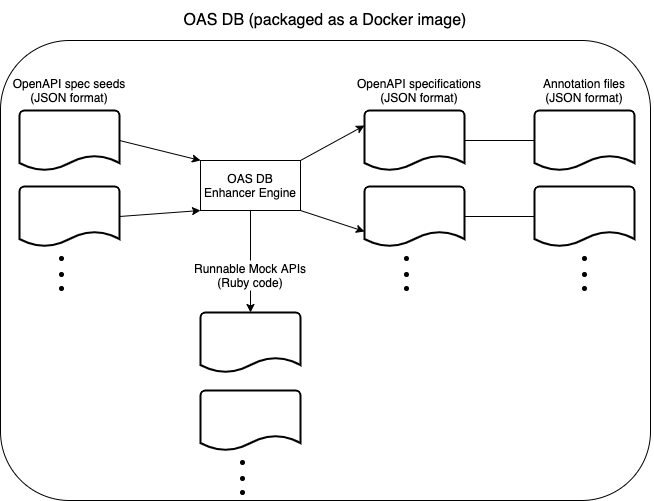

# OAS DB

OAS DB (OpenAPI Specifications Database) aims to provide researchers and industry practitioners a complete solution to streamline the validation of new OpenAPI related techniques and tools. From a small file containing basic information about an API, it is able to generate a complete OpenAPI specification (with the four basic CRUD operations), a mock API implementation and an annotation file (specifying issues and faults that the user may have decided to have the tool inject in these generated assets).



## Running OAS DB

### Dockerfile

The easiest way to run OAS DB. Use the Dockerfile in the root of this repository to build a container with all the required dependencies. Please note that this Dockerfile also contains all the dependencies required to run [RESTler](https://github.com/microsoft/restler-fuzzer), since it was one of the main tools we validated OAS DB against.

### Installing dependencies manually

If you prefer, you can also install OAS DB dependencies manually. Here are the current dependencies:

- Ruby programming language (2.7 series)

After installing the dependencies, navigate to OAS DB main directory and run the following command to install the Ruby libraries used by OAS DB:

```
bundle install
```

## OAS DB OpenAPI seed

A seed is a small fragment of an OpenAPI specification. This file type is custom to OAS DB.

Here is the format of a valid seed:

```
{
  "info": {
    "title": "Payments Provider API.",
    "description": "API that allows one to charge customers via credit card.",
    "version": "0.1"
  },
  "components": {
    "schemas": {
      "Charge": {
        "type": "object",
        "description": "A charge.",
        "properties": {
          "amount": {
            "description": "The amount to be charged.",
            "type": "number"
          },
          "currency": {
            "description": "Three-letter ISO currency code.",
            "type": "string"
          },
          "credit_card_id": {
            "description": "The credit card to be charged.",
            "type": "integer"
          }
        },
        "example": {
          "amount": 20.50,
          "currency": "USD",
          "credit_card_id": 1
        }
      }
    }
  }
}
```

Currently, a seed must contain only **one** object inside its `schemas` section. It must also only contain **one** example of an instance of the aforementioned object.

As future work, we may improve the seed format and allow more complexity in a seed (e.g. multiple objects).

## OAS DB CLI

OAS DB comes with a simple CLI (inside bin/oasdb) that expects a configuration file in the JSON format. A sample configuration file is presented below:

```
{
  "oas_seed_abs_path": "/absolute_path/incident_response.json", # Absolute path to an OpenAPI specification seed.
  "mock_api_server_url": "http://localhost:3000", # URL where the mock API will be reachable when running.
  "spec_issues": [
    "invalid_examples" # List of issues that affect the generated OpenAPI specification.
  ],
  "api_issues": [
    "broken_record_deletion" # List of issues that affect the generated Ruby mock API implementation.
  ],
  "generated_files_basename": "incident_response_invalid_examples" # The basename for the assets to be generated.
}
```

Here is a list of all the `spec_issues` and `api_issues` currently supported:

| Name                         | Config. issue list | Config. value                | Description                                                                                                                                                            |
| ---------------------------- | ------------------ | ---------------------------- | ---------------------------------------------------------------------------------------------------------------------------------------------------------------------- |
| Crudy URI                    | spec_issues        | crudy_uri                    | Injects a HTTP action verb (or a synonym) in the URL                                                                                                                   |
| Amorphous URI                | spec_issues        | amorphous_uri                | Adds superfluous characters to the URL (e.g. a file type suffix such as `.xml`)                                                                                        |
| Ignoring status code         | spec_issues        | ignoring_status_code         | Responses use inappropriate HTTP codes                                                                                                                                 |
| Inappropriate HTTP method    | spec_issues        | inappropriate_http_method    | Requests expect inappropriate HTTP methods                                                                                                                             |
| Invalid examples             | spec_issues        | invalid_examples             | Generates request examples that do not comply to the related objects' schema                                                                                           |
| Sensitive info in the pqs    | spec_issues        | sensitive_info_pqs           | Sensitive info (e.g. a token) is included in paths or query strings                                                                                                    |
| Invalid payload              | api_issues         | invalid_payload              | API crashes (500 response) if an invalid payload is received                                                                                                           |
| Unexpected payload root node | api_issues         | unexpected_payload_root_node | API crashes if the root node of the received payload is not an object                                                                                                  |
| Payload missing keys         | api_issues         | payload_missing_keys         | API crashes if the received payload misses expected keys                                                                                                               |
| Payload extra keys           | api_issues         | payload_extra_keys           | API crashes if the received payload has extra keys                                                                                                                     |
| Payload wrong data types     | api_issues         | payload_wrong_data_types     | API crashes if the received payload has fields with data that does not comply to the data types specified in the object's schema inside the correspondent OpenAPI spec |
| Broken record deletion       | api_issues         | broken_record_deletion       | API responds as if an object was successfully deleted, but the object is not actually destroyed                                                                        |

To run the CLI (from within the project's root folder), call it passing the absolute path to a configuration file:

```
bin/oasdb path_to_config.json
```

## Questions

If you have any problems trying to run OAS DB or have any questions, please feel free to open a new issue in this repository.
